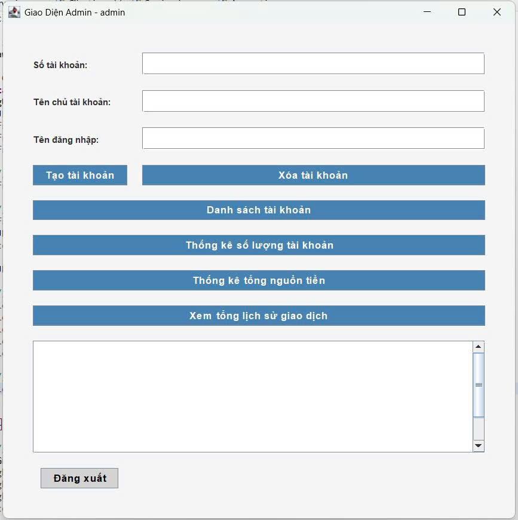
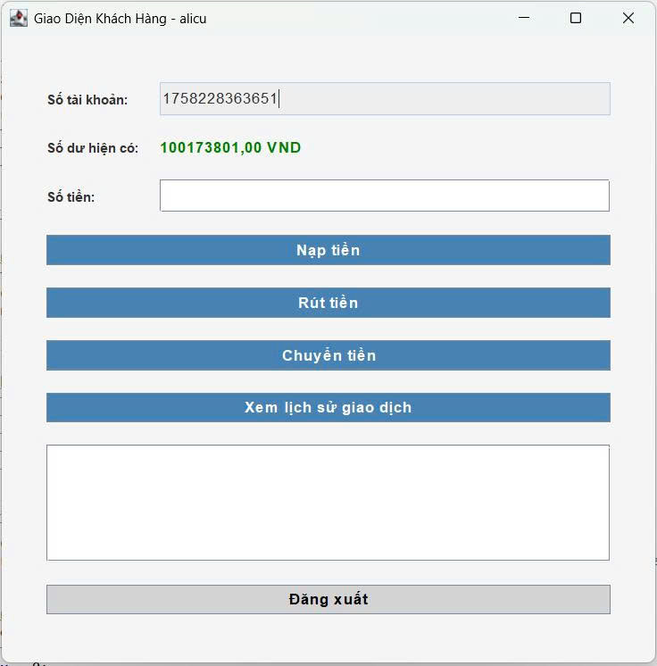
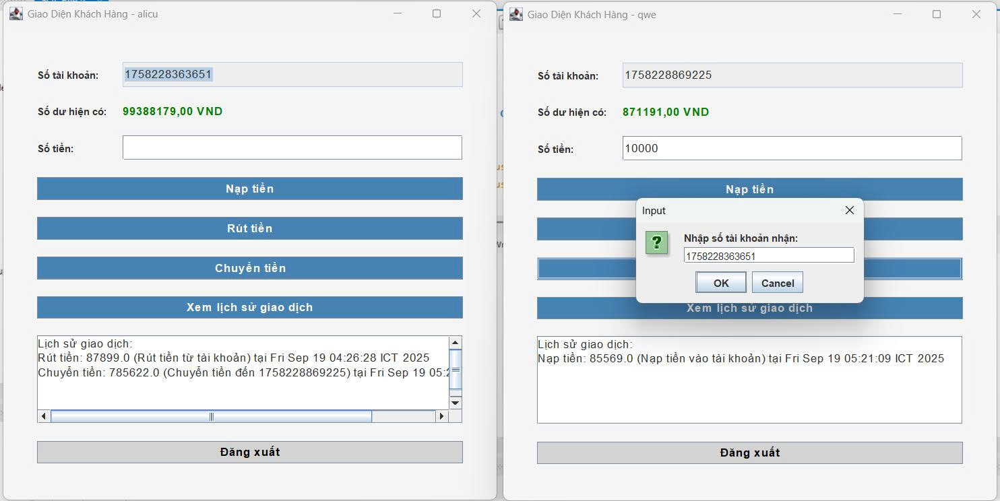

<h2 align="center">
    <a href="https://dainam.edu.vn/vi/khoa-cong-nghe-thong-tin">
    🎓 Faculty of Information Technology (DaiNam University)
    </a>
</h2>

<h2 align="center">
     HỆ THỐNG QUẢN LÝ NGÂN HÀNG MINI
</h2>

<div align="center">
    <p align="center">
        
        
        
    </p>

[](https://www.facebook.com/DNUAIoTLab)
[](https://dainam.edu.vn/vi/khoa-cong-nghe-thong-tin)
[](https://dainam.edu.vn)
</div>

## 1. Giới thiệu hệ thống
**Hệ thống quản lý ngân hàng mini** là một ứng dụng cho phép người dùng quản lý tài khoản ngân hàng và thực hiện các giao dịch tài chính cơ bản thông qua giao diện đồ họa. Hệ thống hỗ trợ hai vai trò chính:

- **Admin**:
  - Tạo và xóa tài khoản ngân hàng.
  - Xem danh sách tất cả tài khoản.
  - Xem thống kê tổng số tài khoản và tổng số dư.
  - Xem toàn bộ lịch sử giao dịch của hệ thống.
- **Customer**:
  - Đăng ký tài khoản và đăng nhập.
  - Nạp tiền, rút tiền, và chuyển tiền giữa các tài khoản.
  - Xem số dư và lịch sử giao dịch cá nhân.

### Kiến trúc hệ thống
- **Client**: Giao diện người dùng được xây dựng bằng **Java Swing**, cung cấp các chức năng cho Admin và Customer.
- **Server**: Xử lý yêu cầu từ client, quản lý dữ liệu trong **MySQL**, sử dụng **Java RMI** để giao tiếp client-server.
- **Cơ sở dữ liệu**: Lưu trữ thông tin người dùng (`users`), tài khoản (`accounts`), và giao dịch (`transactions`).

**Đặc điểm nổi bật**:
- Giao diện trực quan, dễ sử dụng.
- Đảm bảo an toàn giao dịch với kiểm tra số dư trước khi rút hoặc chuyển tiền.
- Hỗ trợ lưu trữ và truy xuất lịch sử giao dịch chi tiết.

## 2. Ngôn ngữ & Công nghệ
- [](https://www.java.com/)
- [](https://docs.oracle.com/javase/8/docs/technotes/guides/rmi/)
- [](https://docs.oracle.com/javase/tutorial/uiswing/)
- [](https://www.mysql.com/)

## 3. Một số màn hình giao diện
<div align="center">
  
  <p><em>Hình 1: Giao diện đăng nhập/đăng ký</em></p>
</div>

<div align="center">
  
  <p><em>Hình 2: Giao diện quản lý tài khoản (Admin)</em></p>
</div>

<div align="center">
  
  <p><em>Hình 3: Giao diện tài khoản khách hàng(Customer)</em></p>
</div>

<div align="center">
  
  <p><em>Hình 4: Giao diện giao dịch (Customer)</em></p>
</div>

## 4. Cài đặt & Sử dụng
### Yêu cầu môi trường
- **JDK**: Java Development Kit 8 trở lên.
- **MySQL**: MySQL Server 8.0 trở lên.
- **IDE**: Eclipse, IntelliJ IDEA, hoặc chạy trực tiếp qua terminal.
### Cấu trúc cơ sở dữ liệu
Tạo cơ sở dữ liệu và các bảng bằng tệp `bank_system.sql`  

# Bank System Database Schema

Dưới đây là script SQL để khởi tạo database `bank_system` với dữ liệu mẫu:

### 1. Tạo Cơ sở dữ liệu

```sql
-- Tạo database
CREATE DATABASE IF NOT EXISTS bank_system;
USE bank_system;

-- Xóa bảng cũ nếu có (để tránh lỗi khi chạy lại nhiều lần)
DROP TABLE IF EXISTS transactions;
DROP TABLE IF EXISTS accounts;
DROP TABLE IF EXISTS users;

-- Bảng users: cho phép role là 'Customer' hoặc 'Admin'
CREATE TABLE users (
    username VARCHAR(50) PRIMARY KEY,
    password VARCHAR(50) NOT NULL,
    role VARCHAR(20) NOT NULL CHECK (role IN ('Customer', 'Admin'))
);

-- Bảng accounts
CREATE TABLE accounts (
    account_number VARCHAR(50) PRIMARY KEY,
    owner_name VARCHAR(100) NOT NULL,
    username VARCHAR(50) NOT NULL,
    balance DOUBLE NOT NULL DEFAULT 0.0,
    FOREIGN KEY (username) REFERENCES users(username) ON DELETE CASCADE
);

-- Bảng transactions
CREATE TABLE transactions (
    id INT AUTO_INCREMENT PRIMARY KEY,
    account_number VARCHAR(50) NOT NULL,
    type VARCHAR(50) NOT NULL,
    amount DOUBLE NOT NULL,
    description VARCHAR(255),
    created_at DATETIME NOT NULL DEFAULT CURRENT_TIMESTAMP,
    FOREIGN KEY (account_number) REFERENCES accounts(account_number) ON DELETE CASCADE
);

-- Thêm tài khoản mẫu
INSERT INTO users (username, password, role) VALUES ('customer1', 'cust123', 'Customer');
INSERT INTO users (username, password, role) VALUES ('customer2', 'cust456', 'Customer');
INSERT INTO users (username, password, role) VALUES ('admin', 'admin123', 'Admin');

INSERT INTO accounts (account_number, owner_name, username, balance) 
VALUES ('12345', 'Nguyen Van A', 'customer1', 1000.0);
INSERT INTO accounts (account_number, owner_name, username, balance) 
VALUES ('67890', 'Tran Thi B', 'customer2', 500.0);

INSERT INTO transactions (account_number, type, amount, description, created_at) 
VALUES ('12345', 'Deposit', 1000.0, 'Nạp tiền thông thường', NOW());
INSERT INTO transactions (account_number, type, amount, description, created_at) 
VALUES ('67890', 'Deposit', 500.0, 'Nạp tiền thông thường', NOW());

-- Kiểm tra dữ liệu
SELECT * FROM users;
SELECT * FROM accounts;
SELECT * FROM transactions;
```
### 2. Cách triển khai
Clone repository về máy   
Import cơ sở dữ liệu bằng file SQL ở trên   
Chạy server RMI   
Chạy client để kết nối   

### 3. Công nghệ sử dụng
Java RMI   
MySQL   
JDBC   

## 5. Thông tin liên hệ 
Sinh viên: Nguyễn Tiến Thái  
Lớp: CNTT 16-01  
Email: tienthai0915@gmail.com  
GitHub: github.com/<your-username>mmr-09</your-username>  

© 2025 AIoTLab – Faculty of Information Technology, DaiNam University
